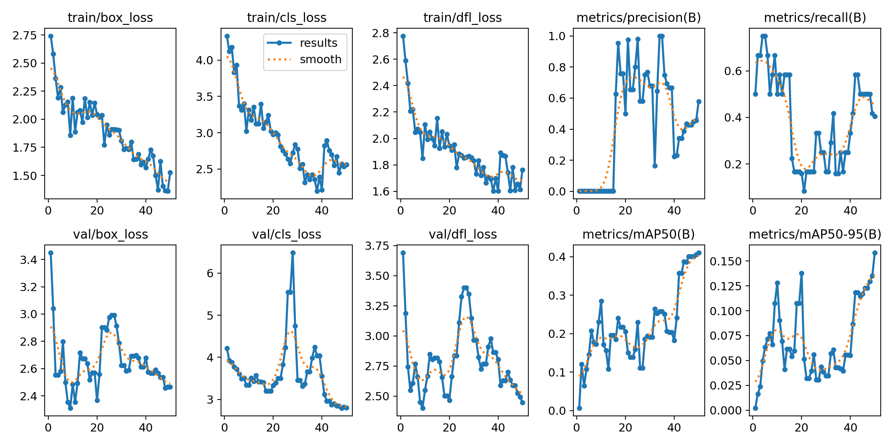
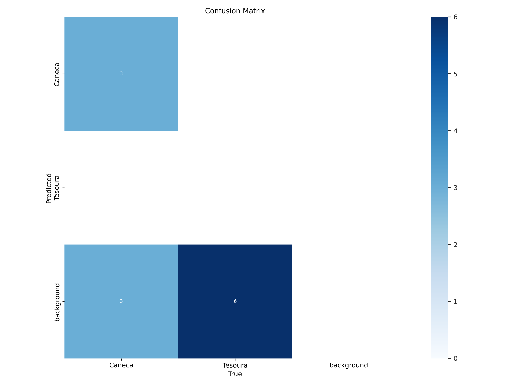

# Detecção de Objetos (Caneca e Tesoura) com YOLOv8

## Descrição do Projeto

Este projeto demonstra o processo completo de treinamento de um modelo de detecção de objetos YOLOv8 para identificar duas classes personalizadas: "Caneca" e "Tesoura". O trabalho envolveu a rotulagem de um dataset de 60 imagens utilizando o Label Studio, a configuração do ambiente de treinamento no Google Colab com GPU (Tesla T4), e a aplicação de transfer learning a partir de um modelo YOLOv8n pré-treinado. O objetivo principal foi cumprir os requisitos de um desafio de projeto da DIO, incluindo a obtenção de um modelo funcional capaz de detectar as novas classes em imagens.

## Tecnologias Utilizadas

*   Python 3
*   YOLOv8 (Ultralytics)
*   Label Studio (para rotulagem de imagens)
*   Google Colab (para treinamento e inferência com GPU)
*   Google Drive (para armazenamento de datasets e resultados)
*   OpenCV (usado implicitamente pelo YOLO)
*   PyTorch (usado implicitamente pelo YOLO)

## Estrutura do Repositório

*   `notebooks/`: Contém o Jupyter Notebook (`Dio_Treinamento_YOLOv8_Caneca_Tesoura.ipynb`) com todo o código para treinamento e inferência.
*   `dataset_config/`:
    *   `data.yaml`: Arquivo de configuração do dataset para o YOLO.
    *   `classes.txt`: Lista das classes ("Caneca", "Tesoura").
*   `sample_results/`:
    *   `images_with_detections/`: Exemplos de imagens de teste com as detecções realizadas pelo modelo treinado.
    *   `training_plots/`: Gráficos gerados durante o treinamento (ex: `results.png`, `confusion_matrix.png`).
*   `model_weights/`: (Opcional) Contém o arquivo `best.pt` com os pesos do melhor modelo treinado.
    *   *Nota: Se o arquivo `best.pt` for muito grande para o GitHub, ele pode ser disponibilizado através de um link para o Google Drive.* 
    *   *Exemplo se linkado:* Os pesos do modelo (`best.pt`) podem ser encontrados [AQUI](LINK_PARA_SEU_GOOGLE_DRIVE_COM_O_BEST.PT_SE_FOR_O_CASO).
*   `README.md`: Este arquivo.

## Como Rodar o Projeto (Treinamento e Inferência)

1.  **Preparar o Dataset:**
    *   As imagens foram rotuladas usando o Label Studio e exportadas no formato YOLO.
    *   O dataset consiste em 60 imagens (`.jpg`, `.jpeg`, `.png`), divididas em 48 para treino e 12 para validação.
    *   Os arquivos de imagem e rótulo (`.txt`) foram organizados no Google Drive conforme a estrutura esperada pelo `data.yaml`, com nomes de arquivo base correspondentes.
2.  **Ambiente:**
    *   O notebook `notebooks/Dio_Treinamento_YOLOv8_Caneca_Tesoura.ipynb` foi projetado para rodar no Google Colab com um ambiente de GPU (Tesla T4 recomendado).
3.  **Executar o Notebook:**
    *   Abra o notebook no Google Colab.
    *   Certifique-se de que o acelerador de hardware está configurado para GPU.
    *   Execute as células em ordem para:
        *   Montar o Google Drive.
        *   Instalar a biblioteca `ultralytics`.
        *   Realizar o treinamento do modelo (os caminhos para `data.yaml` e para salvar os resultados estão configurados para uma estrutura específica no Google Drive, que deve ser replicada pelo usuário se desejar treinar).
        *   Realizar a inferência em imagens de teste (os caminhos para as imagens de teste também precisam ser ajustados conforme a localização no Drive do usuário).

## Resultados do Treinamento

O modelo foi treinado por 50 épocas utilizando o YOLOv8n como base. As principais métricas de validação para o arquivo `best.pt` foram:

| Classe   | Imagens | Instâncias | Precision (P) | Recall (R) | mAP@.5 | mAP@.5:.95 |
| :------- | :------ | :--------- | :------------ | :--------- | :----- | :--------- |
| all      | 12      | 12         | 0.582         | 0.405      | 0.41   | 0.158      |
| Caneca   | 6       | 6          | 0.736         | 0.667      | 0.73   | 0.291      |
| Tesoura  | 6       | 6          | 0.428         | 0.143      | 0.0909 | 0.0259     |

**Gráficos do Treinamento:**

_Legenda: Curvas de métricas e perdas ao longo das épocas de treinamento._

_Legenda: Matriz de confusão para o conjunto de validação._

**Análise:** O modelo demonstrou um bom aprendizado para a classe "Caneca", alcançando um mAP@0.5 de 0.73. O desempenho para a classe "Tesoura" foi inferior (mAP@0.5 de 0.0909), indicando que o modelo teve mais dificuldade com esta classe. Isso pode ser atribuído a fatores como a complexidade visual das tesouras (formatos e ângulos variados, partes finas), menor distinção em relação ao fundo em algumas imagens, ou a quantidade limitada de dados de treinamento e validação para esta classe.

## Demonstração Visual (Exemplos de Detecção)

Abaixo estão exemplos de detecções realizadas pelo modelo treinado (`best.pt`) em imagens de teste que não fizeram parte do conjunto de treino ou validação.

_Legenda: Exemplo de detecção bem-sucedida da classe "Caneca" em uma imagem de teste. (Arquivo: minha_imagem_teste2.jpeg)_

_Legenda: Exemplo de imagem de teste onde nenhuma das classes alvo ("Caneca" ou "Tesoura") foi detectada com o limiar de confiança configurado. (Arquivo: minha_imagem_teste1.jpeg)_

## Desafios Enfrentados e Aprendizados

Durante o desenvolvimento deste projeto, diversos desafios foram encontrados, principalmente relacionados à correta configuração dos dados e do ambiente de desenvolvimento:
*   **Correspondência de Nomes de Arquivo:** Um aprendizado crucial foi a necessidade de garantir que os nomes dos arquivos de imagem e seus respectivos arquivos de rótulo `.txt` fossem idênticos (ignorando a extensão). Discrepâncias aqui levaram ao erro "No labels found" e exigiram uma reorganização cuidadosa dos dados.
*   **Configuração do `data.yaml`:** Assegurar que os caminhos para os datasets de treino/validação e os nomes/ordem das classes estivessem precisamente corretos foi fundamental.
*   **Ambiente Google Colab:** Lidar com a montagem do Google Drive, a correta seleção e ativação da GPU, e os reinícios de ambiente (que exigiam reinstalação de bibliotecas) foram etapas importantes do fluxo de trabalho.
*   **Depuração Iterativa:** O processo de identificar a causa raiz dos erros, como `FileNotFoundError` ou o problema de "No Labels Found", envolveu uma depuração passo a passo, verificando caminhos, nomes de arquivos, conteúdo dos rótulos e arquivos de cache do YOLO.

Esses desafios reforçaram a importância da atenção meticulosa aos detalhes na preparação de dados e configuração do ambiente para projetos de Machine Learning e Visão Computacional.

## Autor

**Tony Cajaiba Cintra**
*   GitHub: [https://github.com/TonyCCintra/](https://github.com/TonyCCintra/)
*   LinkedIn: [SEU_LINK_DO_LINKEDIN_AQUI (opcional)]
